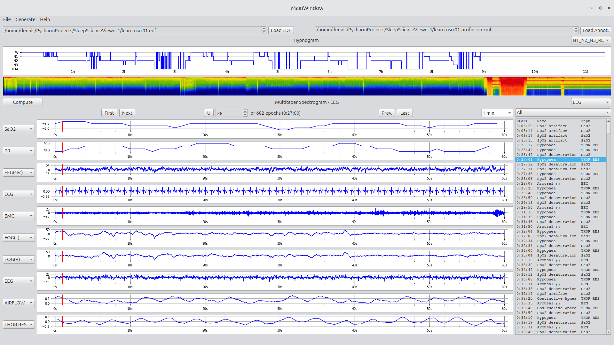

# Sleep Science Viewer

A python native EDF file and XML annotation viewer. 

## Description
SleepScienceViewer is a Python-native application for visualizing and analyzing sleep data stored in EDF (European Data Format) and corresponding annotation files (XML). Designed with sleep science workflows in mind, the tool enables efficient review of signals and sleep stages through a responsive and customizable GUI.



## Key Features

- **EDF & Annotation Support**
   - Load EDF files with associated XML annotation files
   - Visualize up to 10 simultaneous signals
   - View and interact with a full hypnogram display
- **Annotation Interaction**
   - Filter listed annotations by type
   - Double-click on an annotation to jump to the corresponding epoch
- **Custom Display Options**
   - Change epoch duration for signal navigation
   - Toggle how sleep stages are displayed in the hypnogram
   - Generate multi-taper spectrograms for selected signals
- **Report Generation & Export Tools**
   - Generate [EDF summary reports](Media/edf_summary.png)
   - Export individual [signals to folder](Media/signal_export.png)(s) for downstream use
   - Export annotation data including:
      - A [full annotation listing](Media/sleep_event_export.png)
      - [Sleep stage timeline](Media/sleep_stages.png)
      - [Summary reports](Media/sleep_event_summary.png) for review and documentation

## Getting Started

The Sleep Science viewer requires an EDF and Annotation file. We used files downloaded from a [National Sleep Research Resource](https://sleepdata.org/) tutorial for the to develop the interface. 

We recommend using a virtual environment when running the Sleep Science Viewer.

## Intended Use
Ideal for researchers, clinicians, and developers working in sleep research, human performance, or bio-signal analysis. The interface and tools are designed to streamline review and reporting workflows for sleep study data.

## Dependencies
This application was developed in Python 3.12, with the GUI built using PySide6. Please refer to requirements.txt for a complete list of required dependencies.

## Installing

Clone to local environment. See below for run command.

git clone https://github.com/DennisDean/SleepScienceViewer4.git
cd SleepScienceViewer4

## Running the Application

To launch the application, navigate to the installation folder and run:

bash

```
cd .../Install_Folder/
python SleepScienceViewerApp
```

## Help

Help documentation will be added as questions are received and common usage scenarios emerge.
For questions or feedback, feel free to reach out to the author listed below.

## Authors

Contributors names and contact info

**Dennis A. Dean, II, PhD**
dennis.a.dean@gmail.com

## Version History

* v0.1
    * First functioning release

## License

This project is licensed under the **GNU Affero General Public License v3.0 License**.
See the [LICENSE.md](LICENSE.md) file for details

## Acknowledgments
This project builds on work originally developed during my time at **Brigham and Women's Hospital**, where a similar class structure was used in earlier internal tools.

The original **MATLAB version** of this tool was shaped by valuable community feedback received following its public release on **MATLAB Central**.

It also benefited from code developed at **Case Western Reserve University**.

Special thanks to the authors of the [multitaper_spectorgram_python.py](https://github.com/preraulab/multitaper_toolbox/blob/master/python/multitaper_spectrogram_python.py) module, which was refactored for this application to support multi-taper spectrogram visualization.
More information on the multi-taper method can be found on the [Prerau Lab website](https://prerau.bwh.harvard.edu/multitaper/).
