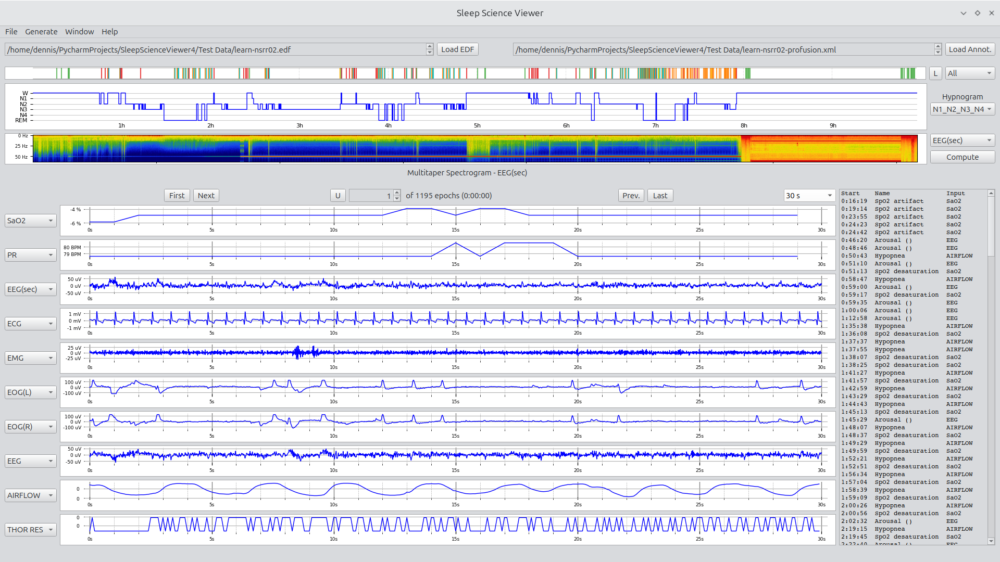
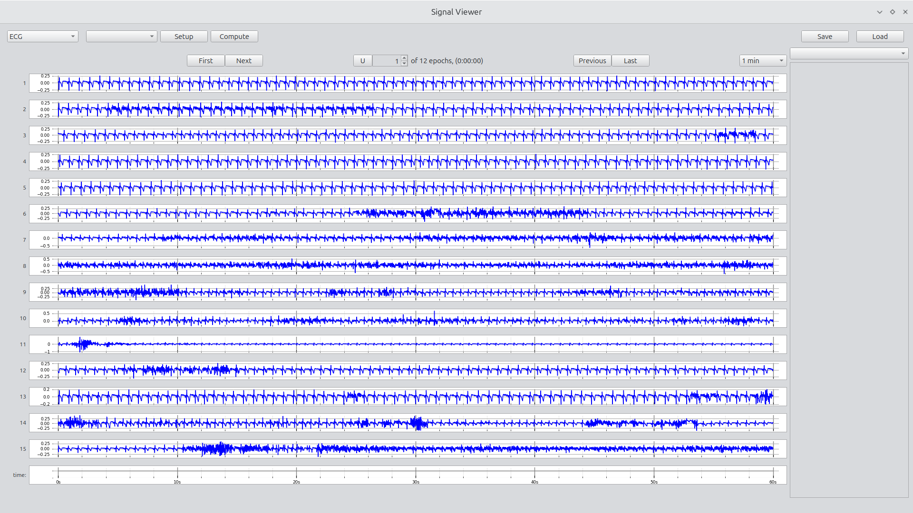
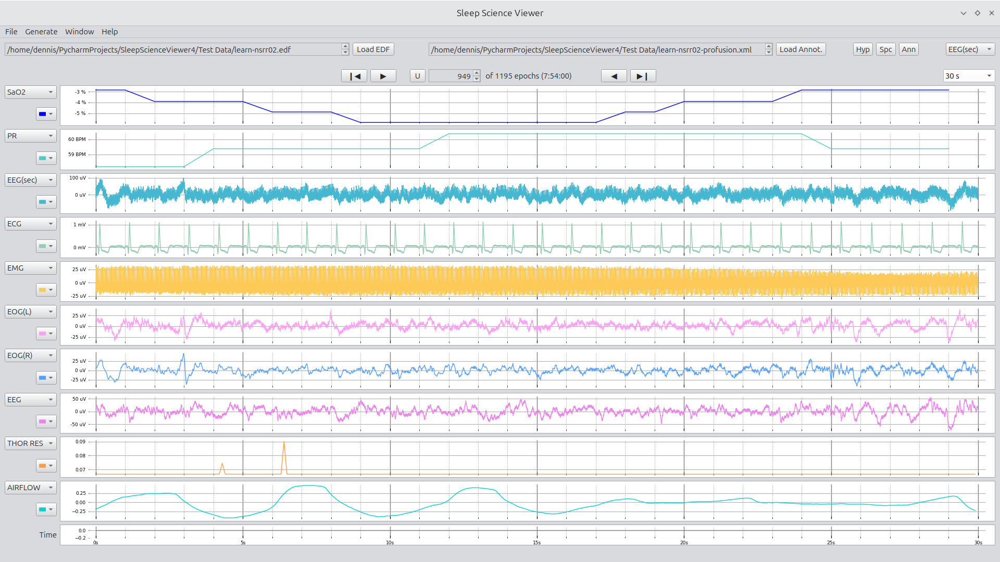
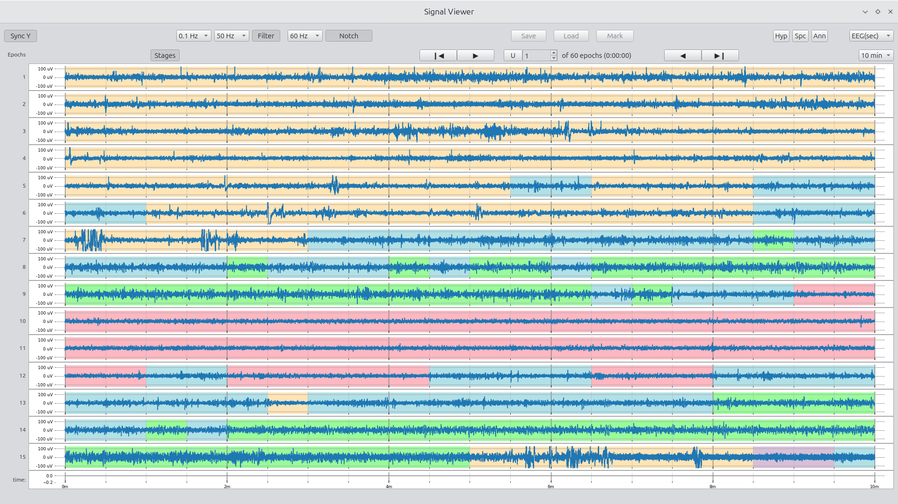
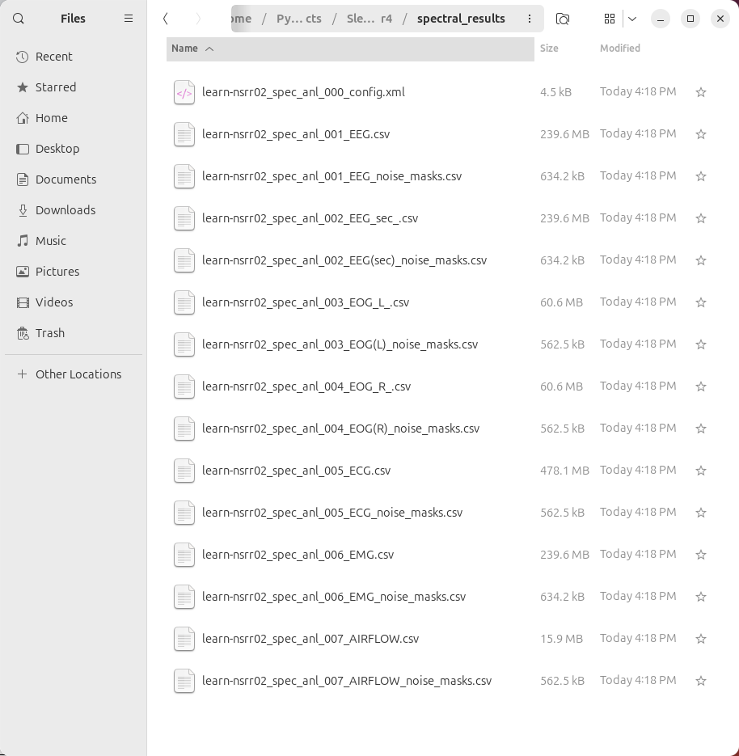

# Sleep Science Viewer

Python-native EDF and XML annotation viewer featuring multi-signal and single-signal displays plus a spectral analysis window.

## Description

**SleepScienceViewer** is a Python-native application for visualizing and analyzing sleep data stored in EDF (European Data Format) files and corresponding XML annotation files. Designed with sleep science workflows in mind, the tool enables efficient review of signals and sleep stages through a responsive and customizable GUI built with PySide6.

The application features:

* **Multi-signal viewer** for synchronized inspection of multiple EEG or physiological channels.
* **Single-signal viewer** for focused review and detailed exploration.
* **Spectral analysis window** for frequency-domain insights, including power band visualizations and noise detection.

SleepScienceViewer uses a modular, class-based architecture to represent both [EDF files](Media/Docs/EDF_File_Class.md) and [annotation files](Media/Docs/Annotation_XML_Class.md). These classes can also be used independently to access or manipulate specific data elements, making them ideal for analysis within notebooks or other Python programs.

The vision for the viewer emerged years ago and has been realized through the wealth of open-source software available today. Guiding principles for development and planned features are outlined in the [vision statement](Media/Docs/vision.md).


**Figure 1.** Sleep Science Viewer interface with signals, hypnogram, spectrogram, and annotations.

## Intended Use

Ideal for researchers, clinicians, and developers working in sleep research, human performance, or bio-signal analysis. The interface and tools are designed to streamline review and reporting workflows for sleep study data. The interface enables preliminary review of results. Generation of spectrogram files and a preliminary set of noise detection masks enables result validation and further analysis.

## Key Features

### Sleep Science Viewer

#### EDF & Annotation Support
- Load EDF files with associated XML annotation files
- Visualize up to 10 simultaneous signals
- View and interact with a full hypnogram display (see Figure 1)

#### Annotation Interaction
- Filter listed annotations by type
- Hypnogram-aligned annotation plot with automatically assigned colors
- Annotation combo box directly linked to annotation plot and list for synchronized selection (see Figure 1)

#### Custom Display Options
- Change epoch duration for signal navigation
- Toggle visibility of hypnogram, spectrogram, and annotation plots (see Figure 3 for signal-only mode)
- Switch hypnogram rendering between line trace and background-colored stage rectangles
- Generate multi-taper spectrograms for selected signals; if not feasible (e.g., low sampling frequency), display a compact heatmap instead
- Customize signal colors via color picker; choices persist across pan/zoom events
- Legends automatically update with user-defined signal colors

#### Report Generation & Export Tools
- Generate EDF summary reports
- Export individual signals to folder(s) for downstream use
- Export annotation data including:
  - Full annotation listing
  - Sleep stage timeline
  - Summary reports for review and documentation

#### Interface
- Show/hide hypnogram, spectrogram, and annotation panels from the main menu (see Figures 1 and 3)

#### Navigation
- Double-click on hypnogram, spectrogram, or annotation plots to move to the selected epoch
- Double-click on annotation list entries to jump to annotation start times


**Figure 2.** Signal Viewer interface displaying a single channel with epochs and overlays.

### Signal Viewer

#### Signals
- View a single signal as a raster plot with 15 epochs displayed vertically (see Figure 2)
- Sleep stages shown as background rectangles behind the signal trace
- X-axis moved to the bottom of the plot for improved readability

#### Interface/Plotting
- Toggle hypnogram, spectrogram, and annotation overlays similar to the main viewer
- Signal-only mode available (see Figure 4)

#### Processing & Analysis
- Compute spectrograms (or default to heatmap if sampling frequency is insufficient)
- Apply common band pass and notch filters on demand

#### Future Considerations
- Displaying annotations directly on signal plots
- Support for marking epochs in-progress

<p align="center">    
<br>
**Figure 3.** Sleep Science Viewer with hypnogram, spectrogram, and annotations hidden (signal-only mode).
</p>

<p align="center">    
<br>
**Figure 4.** Signal Viewer in signal-only mode with hypnogram, spectrogram, and annotations hidden.
</p>

### Spectral Viewer

Signal spectral analysis is the first analysis module supported by the Sleep Science Viewer.

Users can show or hide interface components such as settings, parameters, the hypnogram, spectrogram, and marking sections. These controls allow flexible customization of the workspace. The central button initiates spectrogram computation for selected signals. Three additional buttons—Average, Band, and Spectrogram—allow users to view results in different formats. A Save button enables exporting results and configurations in both computer- and human-readable formats.

The interface includes two main sections for controlling the analysis: **Settings** and **Parameters**.

#### Settings Section
Allows users to select up to ten signals for analysis and choose whether to display an x-axis label. Signal reference and filter parameters are visible but not yet implemented.

#### Parameters Section
Provides options for noise detection, multi-taper spectrogram configuration, and spectral band definition.


<p align="center">    
<br>
**Figure 5.** Spectral Viewer for performing spectral analysis on signals.
</p>

<p align="center">    
<br>
**Figure 6.** Spectral Viewer configured to show spectrograms for multiple signals.
</p>

### Previewing Results

Average, Band, and Spectrogram buttons on the spectral viewer interface allow users to view average spectrum and band boxplots by stage. The graphing functions use the hypnogram setting to create summaries which include all available stages, reduction to stages N1-N3, and REM-NREM. Clicking between different summaries and plotting functions allows users to view the data in multiple ways.

<p align="center">    
<br>
**Figure 7.** Spectral Viewer configured to review a small number of signals.
</p>

<p align="center">    
<br>
**Figure 8.** Viewing average spectrogram by sleep stage.
</p>

<p align="center">    
<br>
**Figure 9.** Viewing bands by sleep stage.
</p>

### Settings and Parameter Options

Providing access to a range of parameters through a visual interface enables interactive analysis—the primary goal of this program. The expectation is that the application will allow users to manually review data in support of batch analyses.

#### Analysis Range
Users can select which section of the data is summarized in plots. Options include First Wake, First Wake and Sleep, Sleep Only, and Ending Wake. The application automatically identifies the first and last sleep periods to define the sleep section. An alternative method using lights-on and lights-off timing is noted but not yet implemented.

#### Filter
Implements band and notch filtering. Spectrogram results reflect the applied filters. The code is implemented within the EDF and multi-taper modules.

#### Multi-Taper
The multi-taper approach provides more flexibility for analyzing data than traditional Fourier transform methods. Parameters can be tuned to balance between frequency and time resolution, allowing users to explore the full range of signals available in a sleep study.

#### Noise Detection
A simple noise detection algorithm identifies large perturbations in the sleep EEG. The program writes noise detection masks to disk as separate files. Since the viewer's goal is to help users understand the data, these masks can be used for post-processing and further analysis.

#### Spectral Bands
Six frequency bands are defined, with defaults commonly used for EEG analysis. These settings may need adjustment for other signal types.

### Saving Results

Clicking the save button initiates writing a configuration file (XML) and results + noise detection mask files for each signal. The noise mask file includes: `delta_time_mask`, `beta_time_mask`, `union_time_mask`, and `intersection_time_mask`. The masks are provided as a starting point for evaluating noise content.

<p align="center">    
<br>
**Figure 10.** Viewing bands by sleep stage.
</p>


## Known Limitations

Double-click navigation has been implemented but may exhibit instability due to matplotlib's integration limitations with PySide6. Minimize frequent switching between the Sleep Science Viewer and Signal Viewer windows to reduce potential instability.

Testing was conducted using a limited sample dataset developed for tutorial purposes. The test data contain clear non-physiological components, which limit the ability to effectively evaluate simple noise detection methods and band computations. Reference signals are collected in the interface; however, re-referencing was not implemented because the sample data did not include reference EEG channels.

## Future Development

Several features are under consideration for future implementation. These capabilities can be developed quickly based on user interest. Please reach out if any of the following areas are of interest:

### Annotation
- Overlay annotations directly on signals in both the main and signal views

### Noise Mask Enhancements
- Export stage masks to support offline summary generation
- Export epoch-level noise masks for more granular data review

### Noise Mask Interaction
- Write noise masks to the marking section for visual inspection and review
- Display noise masks alongside spectrograms for improved interpretation

### Open-Source Visualization
- Automate the generation of publication-quality spectrogram, average, and band plots using open-source tools that provide functionality similar to Origin

## Getting Started

The Sleep Science Viewer requires an EDF and Annotation file. We used files downloaded from the National Sleep Research Resource tutorial to develop the interface.

We recommend using a virtual environment when running the Sleep Science Viewer.

### Dependencies

This application was developed in Python 3.12, with the graphical user interface (GUI) built using PySide6. For a complete list of required dependencies, please refer to `requirements.txt`.

Users should be mindful of the memory demands associated with displaying multiple spectrograms. As a reference point, displaying ten 11-hour ECG spectrograms requires approximately 25 GB of memory.

### Download Test Data

We tested the SleepScienceViewer with data from the National Sleep Research Resource.

### Installing

#### 1. Install pipx
```bash
python -m pip install --user pipx
python -m pipx ensurepath
```

#### 2. Install SleepScience Viewer
```bash
pipx install sleepscienceviewer
```

### Running the Application

To launch the application:
```bash
SleepScienceViewer
```

## Help

Help documentation will be added as questions are received and common usage scenarios emerge. For questions or feedback, feel free to reach out to the author listed below.

## Authors

**Dennis A. Dean, II, PhD**  
dennis.a.dean@gmail.com

## Version History

### v0.4
- Spectral window is functional with the primary goal of reviewing results before batch processing
- Spectral settings and parameters that control computation are passed through to computation
- Result visualizations include average spectrogram and band plots
- Simple noise identification implemented and saved for post-processing
- Saving results includes spectrograms (CSV), computation configuration (XML), and noise masks

### v0.3
- Initial release of the spectral window class for creating multi-taper spectrograms
- Created parameter dictionaries to support saving results with full range of parameters
- Spectrogram UI iterated on to define requirements, reusing code from signal window

### v0.2
- Added display toggles for hypnogram, spectrogram, and annotation panels
- Hypnogram background color rendering for sleep stages
- Annotation synchronization between combo box, plot, and list
- Spectrogram-to-heatmap fallback for low sampling rates
- Signal color customization with legends
- Added Signal Viewer with raster view of single-channel data

### v0.1
- First functioning release

## License

This project is licensed under the GNU Affero General Public License v3.0. See the LICENSE.md file for details.

## Acknowledgments

This project builds on work originally developed during my time at Brigham and Women's Hospital, where a similar class structure was used in earlier internal tools.

The original MATLAB version of this tool was shaped by valuable community feedback received following its public release on MATLAB Central.

It also benefited from code developed at Case Western Reserve University.

Special thanks to the authors of the `multitaper_spectrogram_python.py` module, which was refactored for this application to support multi-taper spectrogram visualization. More information on the multi-taper method can be found on the Prerau Lab website.


